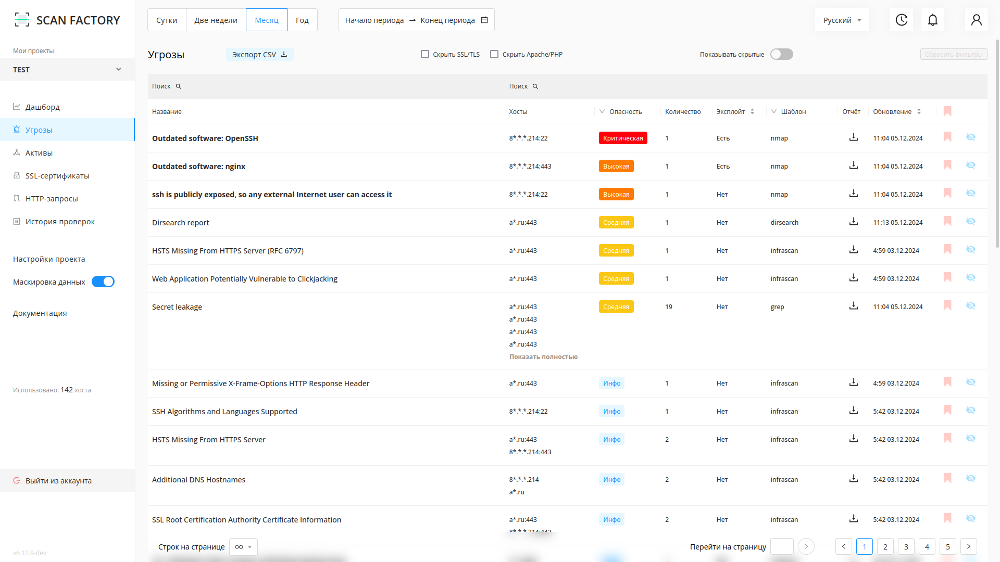

# Быстрый старт

---

С помощью данной статьи вы сможете оценить функционал и возможности решения. Чтобы протестировать решение в вашей компании, запишитесь на пилот: [support@scanfactory.io](mailto:support@scanfactory.io)

## 1. Создайте и запустите новый проект

Перейдя во вкладку `Проекты` нажмите на кнопку `Создать проект` . Заполните появившуюся форму. Укажите имя проекта, цели сканирования: хотя бы один домен, вайлдкард, IP или подсеть (Рис. 1.2).

Нажмите на кнопку `Создать`, если хотите провести более тонкую настройку проекта перед запуском сканирований, либо `Cоздать и сканировать`, если хотите оставить остальные параметры по умолчанию и начать скан немедленно.

Некоторые из возможностей более тонкой настройки проекта:

- создание черных списков для http-ссылок, доменов и IP;
- указание временного интервала для проведения сканирований (например, только 1:00-5:00 утра);
- настройка и создание шаблонов сканирований отдельно для каждого инструмента.

Развернутые инструкции по настройке можно найти [в разделе Техническая Документация](./technical-overview.md).

!!!
Перед стартом сканирования необходимо добавить наши IP-адреса `158.160.8.240/28` в whitelist на ваших WAF/IDS.  
!!!

## 2. Настройте проект

Выберите созданный проект из списка. Перед вами появится страница настроек (Рис. 2.1)  

- **Домены:** домены (например, `yandex.ru`) и вайлдкарды (например, `*.yandex.ru`). Вайлдкард `*.yandex.ru` означает, что сканированию подлежит домен `yandex.ru` и все его поддомены.
- **IP и подсети:** адреса IPv4 и подсети (например, `11.22.33.44/24`).
- **Blacklist скоупа:** черный список, где могут быть указаны домены, вайлдкарды, регулярные выражения (для доменов), IPv4 адреса и подсети и регулярные выражения для HTTP ссылок.
Примеры:
  - `re:xyz.u\d+.domain.com`
  - `domain.com`
  - `*.sub.domain.com`
  - `https?://domain.com/foo/\w+`
- **Исключения из blacklist-a:** Здесь можно указать исключения из черного списка. Могут быть указаны домены, вайлдкарды, регулярные выражения (для доменов), IPv4 адреса и подсети и регулярные выражения для HTTP ссылок.
- Переключатель **"Ручное подтверждение новых активов"** означает, ни один домен не будет просканирован пока его IP-адреса не будут занесены вами в **IP и подсети**.  
Используйте её, чтобы сканирование не шло по ресурсам, которые расположены на IP-адресах сторонних организаций.  

!!!
Ручное подтверждение новых активов "Включено" (по умолчанию) - добавляйте IP адреса интересующих Вас доменов вручную, иначе они не будут просканированы.  
Ручное подтверждение новых активов "Выключено" - IP адреса доменов проекта будут заноситься в скоуп автоматически.  
!!!

Вы можете провести тонкую конфигурацию запускаемых сканеров. Подробнее об этом - в разделе [Технический обзор ScanFactory](/technical-overview.md) 

## 3. Дашборд

В данном разделе отображается сводная статистика работы Системы.

## 4. Активы

Активы - страница, которая отображает текущее состояние инфраструктуры Заказчика.

После окончания сканирования на странице Активов будут отображены найденные IP, порты и домены.

## 5. Уязвимости

Функционал раздела “Уязвимости” позволяет:

- Просматривать все обнаруженные уязвимости;  
- Управлять статусом уязвимостей;  
- Выполнять поиск и фильтрацию уязвимостей по заданным параметрам;  
- Просмотреть подробную информацию об уязвимости в карточке уязвимости;  
- Выгрузить события в формате JSON.  

Нажав на название уязвимости возможно перейти на карточку уязвимости, и получить подробную информацию о ней.  
В карточке уязвимости указаны:

- Название  
- Дата обнаружения
- Компонент, который обнаружил уязвимость
- Статус
- Уровень важности
- Описание
- Шаги по воспроизведению

## 6. Подключение телеграм-бота

Начните диалог с телеграм-ботом: [`@scanfactory_reporter_bot`](https://t.me/scanfactory_reporter_bot)

Подключите бота к вашему Личному Кабинету с помощью команды:  
`/connect https://yx-client.scanfactory.io/api/ token <TOKEN>`

Рабочий токен вы можете получить, связавшись с технической поддержкой.  
