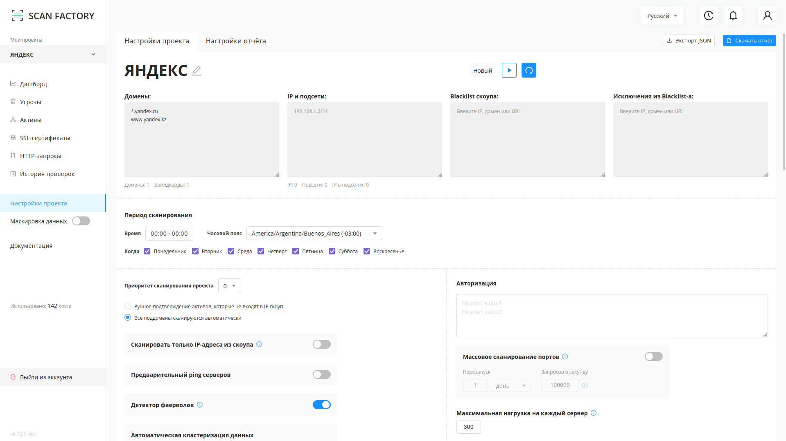
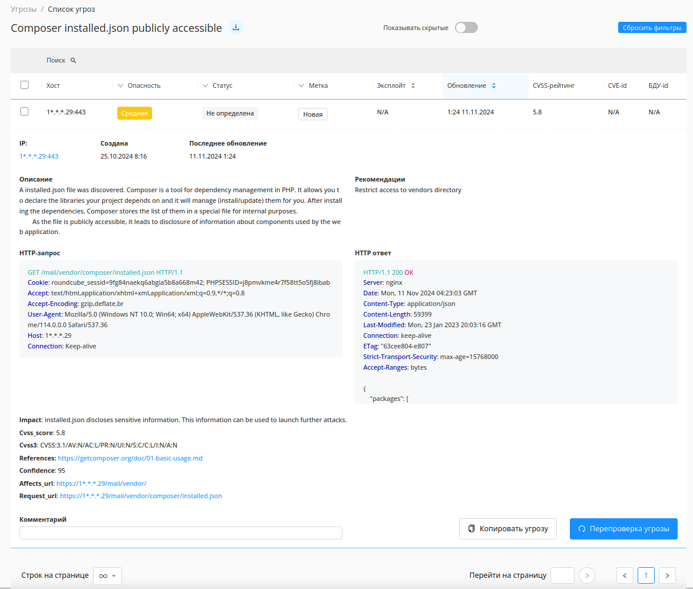
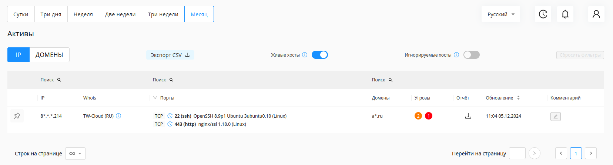
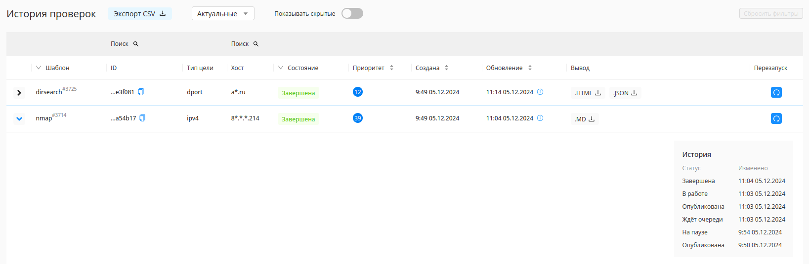

# Быстрый старт

---

С помощью данной статьи вы сможете оценить функционал и возможности решения.
Записаться на тестирование решения вы можете по ссылке: [https://scan-factory.ru](https://scan-factory.ru)

## 1. Создайте и запустите новый проект

Перейдя во вкладку `Мои проекты` нажмите на кнопку `Создать проект`.

Заполните появившуюся форму. Укажите имя проекта, режим сканирования целей (`ПЕРИМЕТР`, `Внутренняя сеть`, `OSINT`, `METASCAN`, `ВЕБ`: они различаются набором сканеров, по умолчанию `ПЕРИМЕТР` - все сканеры включены), цели сканирования: хотя бы один домен, вайлдкард, IP или подсеть. Подробнее о этапах сканирования в разделе [Технический Обзор](./technical-overview.md).

Режимы:  

`Периметр` - по умолчанию, включает в себя все сканеры для общего сканирования активов  
`Внутренняя сеть` - сканирование внутренней сети на On-premise инсталляции раз в неделю  
`OSINT` - сканирование активов с разведкой по открытым источникам  
`Metascan` - сканирование только с помощью opensource инструментов  
`Веб` - сканирование веб приложений  

В этом окне будут дополнительные настройки сканирования, которые можно будет менять и после создания проекта. Например, период сканирования, по умолчанию проект будет запущен всегда:

Нажмите на кнопку `Создать проект` после внесения интересующих вас изменений. Новый проект будет на паузе, пока вы не запустите его в настройках или из вкладки `Мои проекты`.

## 2. Настройте проект

Сразу после создания проекта перед вами откроются его настройки:

На этой странице вы можете:

1. редактировать черные списки для http-ссылок, доменов и IP;
2. указывать временной интервал для проведения сканирований (например, только 1:00-5:00 утра каждый день, кроме выходных);
3. настраивать и создавать шаблоны сканирований отдельно для каждого инструмента.
4. скачать отчет о найденных уязвимостях и сканировании по выбранному проекту

- **Домены:** домены (например, `yandex.ru`) и вайлдкарды (например, `*.yandex.ru`). Вайлдкард `*.yandex.ru` означает, что сканированию подлежит домен `yandex.ru` и все его поддомены.
- **IP и подсети:** адреса IPv4 и подсети (например, `11.22.33.44/24`).
- **Blacklist скоупа:** черный список, где могут быть указаны домены, вайлдкарды, регулярные выражения (для доменов), IPv4 адреса и подсети и регулярные выражения для HTTP ссылок.
Примеры:
  - `re:xyz.u\d+.domain.com`
  - `domain.com`
  - `*.sub.domain.com`
  - `https?://domain.com/foo/\w+`
- **Исключения из blacklist-a:** Здесь можно указать исключения из черного списка. Могут быть указаны домены, вайлдкарды, регулярные выражения (для доменов), IPv4 адреса и подсети и регулярные выражения для HTTP ссылок.  
- Переключатель **"Ручное подтверждение новых активов, которые не входят в скоуп"** означает, ни один домен не будет просканирован пока его IP-адреса не будут занесены вами в **IP и подсети**.  
- **Сканировать только IP-адреса из скоупа:** Система сканирует только IP-адреса из скоупа. IP-адреса, в которые резолвятся домены, не сканируются  
Используйте её, чтобы сканирование не шло по ресурсам, которые расположены на IP-адресах сторонних организаций.  
- **Предварительный Ping серверов:** Scanfactory будет предварительно проверять доступность указанных адресов и доменов перед сканированием, если ресурс недоступен, сканирование по нему не будет выполняться.  
- **Детектор фаерволов:** Периодическая проверка открытых портов. Если на ранее открытый порт возвращается таймаут, то порт помечается, как заблокированный фаерволом. Рекомендуем отключать во время сканирования локальных сетей.  
- **Автоматическая кластеризация данных (защита от флуда):** процесс группировки схожих или одинаковых ссылок и доменов для предотвращения засорения системы идентичной информацией и для упрощения просмотра активов и уязвимостей.  

Развернутые инструкции по настройке можно найти в разделе [Технический обзор](./technical-overview.md).

Настройки шаблонов сканирования:

По умолчанию будут запущены все шаблоны.  
У каждого шаблона есть `таймаут` - максимальное время за которое одна задача должна быть завершена или время, после которого сканирование будет завершено с ошибкой.  
`Перезапуск` - время, спустя которое сканер, связанный с данным шаблоном, заново начнет сканировать уязвимости. Например, перезапуск infrascan - 1 день: после выполнения всех задач этим сканером, повторное сканирование он будет выполнять только через 1 день.  
`Приоритет` - чем выше приоритет, тем выше в очереди будут находиться задачи этого шаблона.  
`Нагрузка` - "вес" задач шаблона, позволяет рассчитать количество запускаемых задач, сумма нагрузки которых меньше или равна выбранной нагрузке на каждый сервер.  
`Повтор задач` - количество перезапусков в случае ошибки.

Более подробную информацию о сканерах и их настройке можно найти в разделах [Список используемых сканеров](./scanners.md) и [Решение проблем](./problems.md).

!!!
Ручное подтверждение новых активов "Включено" - добавляйте IP адреса интересующих Вас доменов вручную, иначе они не будут просканированы.  
Ручное подтверждение новых активов "Выключено" (по умолчанию) - IP адреса доменов проекта будут заноситься в скоуп автоматически.  
!!!

Вы можете провести тонкую конфигурацию запускаемых сканеров. Подробнее об этом - в разделе [Технический обзор ScanFactory](/technical-overview.md)

## 3. Боковая панель

На боковой панели вы можете найти все разделы, необходимые для управления.  
Мои проекты, Дашборд, Угрозы, Активы, SSL-сертификаты, HTTP-запросы, История проверок, а также Настройки проекта и ссылка на данную документацию.  

## 4. Дашборд

На данной странице отображена статистика по одному или всем проектам за выбранный промежуток времени.

## 5. Угрозы

Функционал раздела "Угрозы" позволяет:

- Просматривать все обнаруженные уязвимости;  
- Закреплять важные уязвимости и скрывать не интересующие;  
- Управлять статусом уязвимостей, назначать им уровень опасности;  
- Выполнять поиск и фильтрацию уязвимостей по заданным параметрам;  
- Просматривать подробную информацию об уязвимости в ее карточке;  
- Скачать отчет по уязвимости в формате PDF или выгрузить уязвимости в формате CSV.

Нажав на название уязвимости возможно перейти на карточку уязвимости, и получить подробную информацию о ней.  
В карточке уязвимости указаны:

- Название  
- Дата обнаружения
- Компонент, который обнаружил уязвимость
- Статус
- Уровень важности
- Описание
- Шаги по воспроизведению

Выбранную уязвимость можно перепроверить, нажав на кнопку `Перепроверка угрозы` на карточке.

## 6. Активы

По окончании сканирования на странице будет отображано текущее состояние инфраструктуры, это найденные IP, порты и домены.

Сверху страницы находятся переключатели `Сутки`, `Три дня` и т.д. Они позволяют просматривать активы, порты которых последний раз были найдены в течение выбранного промежутка времени. По кнопке `Экспорт CSV` можно выгрузить активы с учетом выбранного периода выше в формате CSV.
Переключатель `Живые хосты` позволяет просматривать активные или неактивные хосты, когда переключатель `Игнорируемые хосты` показывает активы, находящиеся в черном списке.

!!!
Хост считается живым, если у него есть хотя бы один открытый порт
!!!

Важные записи на странице можно закреплять и писать к ним комментарии. Колонка `Угрозы` отображает количество критических, высоких и средних уязвимостей, найденных на активе. Отчет об этих уязвимостях можно скачать, нажав на соответствующую кнопку в колонке `Отчет`. Для доменов доступны скриншоты страницы для стандартных портов, PDF отчеты по всем или только критическим уязвимостям.  

## 7. SSL-сертификаты

На этой странице показаны найденные SSL-сертификаты, для какого они хоста, на каких портах, кем сертификат выдан, алгоритм шифрования, размер ключа и дата истечения сертификата.

## 8. HTTP-запросы

На этой странице показаны все запросы к найденным доменам, коды ответа, путь, на который был отправлен запрос, хост и порт. При нажатии на запрос вы увидите дополнительную информацию, подробности запроса и ответа.

## 9. История проверок

Здесь находятся все проверки, производимые сканерами. На этой странице можно выгрузить произведенные проверки в файл формата CSV, просмотреть архивные и скрытые задачи.

!!!
Архивация задач происходит спустя 7 дней после сканирования.
!!!

Таблица поддерживает фильтрацию по шаблону, по статусам сканов; сортировку по времени создания и обновления задачи, а также поиск по хостам и ID задачи. В столбце `Вывод` можно скачать отчет, созданный сканером или результат его работы. В конце строки каждой задачи можно нажать кнопку перезапуска, это действие создаст идентичную задачу с максимальным приоритетом. Строки задач можно раскрывать и просмативать ход сканирования, это статусы задач и их изменение с привязкой ко времени.

## 10. Подключение телеграм-бота

Начните диалог с телеграм-ботом: [`@scanfactory_reporter_bot`](https://t.me/scanfactory_reporter_bot)

Подключите бота к вашему Личному Кабинету с помощью команды:  
`/connect https://your_app.sf-cloud.ru/api/ token <TOKEN>`

Рабочий токен вы можете получить, связавшись с технической поддержкой.  
