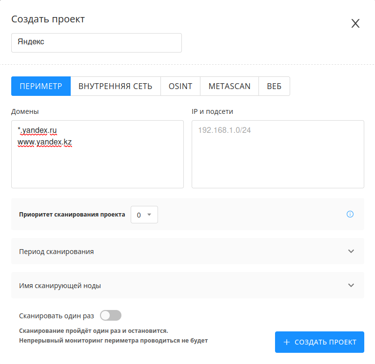
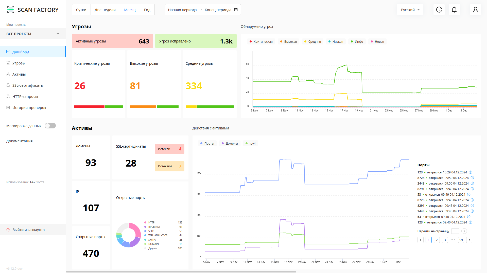

# Быстрый старт

---

С помощью данной статьи вы сможете оценить функционал и возможности решения.
Записаться на тестирование решения вы можете по ссылке: [https://scan-factory.ru](https://scan-factory.ru)

## 1. Создайте и запустите новый проект

Перейдя во вкладку `Мои проекты` нажмите на кнопку `Создать проект`.

Заполните появившуюся форму. Укажите имя проекта, пресет сканирования целей (ПЕРИМЕТР, WEB, OSINT: они различаются набором сканеров, по умолчанию ПЕРИМЕТР - все сканеры включены), цели сканирования: хотя бы один домен, вайлдкард, IP или подсеть. Подробнее о этапах сканирования в разделе [Технический Обзор](./technical-overview.md).

В этом окне будут дополнительные настройки сканирования, которые можно будет менять и после создания проекта. Например, период сканирования, по умолчанию проект будет запущен всегда:

Нажмите на кнопку `Создать проект` после внесения интересующих вас изменений. Новый проект будет на паузе, пока вы не запустите его из вкладки `Мои проекты`.

## 2. Настройте проект

Сразу после создания проекта перед вами откроются его настройки:

На этой странице вы можете:

1. редактировать черные списки для http-ссылок, доменов и IP;
2. указывать временной интервал для проведения сканирований (например, только 1:00-5:00 утра каждый день, кроме выходных);
3. настраивать и создавать шаблоны сканирований отдельно для каждого инструмента.
4. скачать отчет о найденных уязвимостях и сканировании по выбранному проекту

- **Домены:** домены (например, `yandex.ru`) и вайлдкарды (например, `*.yandex.ru`). Вайлдкард `*.yandex.ru` означает, что сканированию подлежит домен `yandex.ru` и все его поддомены.
- **IP и подсети:** адреса IPv4 и подсети (например, `11.22.33.44/24`).
- **Blacklist скоупа:** черный список, где могут быть указаны домены, вайлдкарды, регулярные выражения (для доменов), IPv4 адреса и подсети и регулярные выражения для HTTP ссылок.
Примеры:
  - `re:xyz.u\d+.domain.com`
  - `domain.com`
  - `*.sub.domain.com`
  - `https?://domain.com/foo/\w+`
- **Исключения из blacklist-a:** Здесь можно указать исключения из черного списка. Могут быть указаны домены, вайлдкарды, регулярные выражения (для доменов), IPv4 адреса и подсети и регулярные выражения для HTTP ссылок.
- Переключатель **"Ручное подтверждение новых активов, которые не входят в скоуп"** означает, ни один домен не будет просканирован пока его IP-адреса не будут занесены вами в **IP и подсети**.  
Используйте её, чтобы сканирование не шло по ресурсам, которые расположены на IP-адресах сторонних организаций.  
- **Предварительный Ping серверов:** Scanfactory будет предварительно проверять доступность указанных адресов и доменов перед сканированием, если ресурс недоступен, сканирование по нему не будет выполняться.

Развернутые инструкции по настройке можно найти в разделе [Технический обзор](./technical-overview.md).

Настройки шаблонов сканирования:

По умолчанию будут запущены все шаблоны. У каждого шаблона есть `таймаут`, максимальное время за которое одна задача должна быть завершена или время, после которого сканирование будет завершено с ошибкой, `перезапуск`, время, спустя которое сканер, связанный с данным шаблоном, заново начнет сканировать уязвимости. Например, перезапуск infrascan - 1 день: после выполнения всех задач этим сканером, повторное сканирование он будет выполнять только через 1 день.

Более подробную информацию о сканерах и их настройке можно найти в разделах [Список используемых сканеров](./scanners.md) и [Решение проблем](./problems.md).

!!!
Ручное подтверждение новых активов "Включено" - добавляйте IP адреса интересующих Вас доменов вручную, иначе они не будут просканированы.  
Ручное подтверждение новых активов "Выключено" (по умолчанию) - IP адреса доменов проекта будут заноситься в скоуп автоматически.  
!!!

Вы можете провести тонкую конфигурацию запускаемых сканеров. Подробнее об этом - в разделе [Технический обзор ScanFactory](/technical-overview.md)

## 3. Боковая панель

На боковой панели вы можете найти все разделы, необходимые для управления.
Мои проекты, Дашборд, Угрозы, Активы, SSL-сертификаты, HTTP-запросы, История проверок, а также Настройки проекта и ссылка на данную документацию.

## 4. Дашборд

На данной странице отображена сводная статиска по выбранному проекту или системе.

## 5. Угрозы

Функционал раздела "Угрозы" позволяет:

- Просматривать все обнаруженные уязвимости;  
- Управлять статусом уязвимостей;  
- Выполнять поиск и фильтрацию уязвимостей по заданным параметрам;  
- Просмотреть подробную информацию об уязвимости в карточке уязвимости;  
- Выгрузить события в формате JSON.

Нажав на название уязвимости возможно перейти на карточку уязвимости, и получить подробную информацию о ней.  
В карточке уязвимости указаны:

- Название  
- Дата обнаружения
- Компонент, который обнаружил уязвимость
- Статус
- Уровень важности
- Описание
- Шаги по воспроизведению

## 6. Активы

Активы - страница, которая отображает текущее состояние инфраструктуры Заказчика.

После окончания сканирования на странице Активов будут отображены найденные IP, порты и домены. Важные записи на странице можно закреплять. Отчет об активе можно скачать, нажав на соответствующую кнопку в колонке `Отчет`. Для доменов доступны скриншоты страницы для стандартных портов, отчеты сканера dirsearch доступны по нажатию на интересующий найденный порт, и отчеты по активу, как и для IP.

## 7. SSL-сертификаты

На этой странице показаны найденные SSL-сертификаты, для какого они хоста, на каких портах, кем сертификат выдан, алгоритм шифрования, размер ключа и дата истечения сертификата.

## 8. HTTP-запросы

На этой странице показаны все запросы к найденным доменам, коды ответа, путь, на который был отправлен запрос, хост и порт. При нажатии на запрос вы увидите дополнительную информацию, подробности запроса и ответа.

## 9. История проверок

На данной странице вы найдете все проверки, производимые сканерами. Таблица поддерживает фильтрацию по шаблону, по статусам сканов, времени создания и обновления задачи, а также поиск по хостам.

## 10. Подключение телеграм-бота

Начните диалог с телеграм-ботом: [`@scanfactory_reporter_bot`](https://t.me/scanfactory_reporter_bot)

Подключите бота к вашему Личному Кабинету с помощью команды:  
`/connect https://yx-client.scanfactory.io/api/ token <TOKEN>`

Рабочий токен вы можете получить, связавшись с технической поддержкой.  
