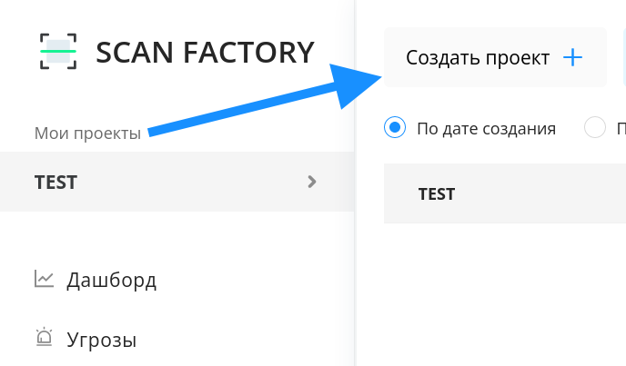

# Быстрый старт
----

### 0. Вступление

Платформа Scanfactory 

### 1. Создайте и запустите новый проект.

Перейдя во вкладку `Проекты` нажмите на кнопку `Создать проект` (Рис. 1.1).

Заполните появившуюся форму. Укажите имя проекта, цели сканирования: хотя бы один домен, вайлдкард, IP или подсеть (Рис. 1.2).

Нажмите на кнопку `Создать`, если хотите провести более тонкую настройку проекта перед запуском сканирований, либо `Cоздать и сканировать`, если хотите оставить остальные параметры по умолчанию и начать скан немедленно. 

Некоторые из возможностей более тонкой настройки проекта:
- создание черных списков для http-ссылок, доменов и IP;
- указание временного интервала для проведения сканирований (например, только 1:00-5:00 утра);
- настройка и создание шаблонов сканирований отдельно для каждого инструмента.

Развернутые инструкции по настройке проекта можно найти здесь.

!!!
Если у Вас есть WAF/IDS, то необходимо добавить в whitelist наши IP-адреса 158.160.8.240/28, с которых будет проводиться сканирование.
!!!

После создания проекта, выберите свой из списка во вкладке `Проекты` и нажмите на него. (Рис. 1.3)

Перед вами появится его страница. (Рис. 1.4.)

Если ранее вы выбрали `Создать` и теперь готовы к тому чтобы начать сканирование нажмите кнопку старта в правом врехнем углу страницы проекта. 
Чтобы поставить уже запущеный проект на паузу воспользуйтесь той же кнопкой.

### 2. Настройка скоупа

На странице проекта кроме возможности запустить проект или поставить его на паузу есть панель управления целями сканирования (скоупом). Оно похоже на то что появлялось в самом начале на этапе создания проекта, но имеет несколько дополнительных полей.

- **Домены:** домены (например `google.com`, `ya.ru`, `vk.com`) и вайлдкарды (например `*.google.com`). Вайлдкард `*.domain.com` значит что сканированию подлежит домен `domain.com` и все его поддомены. 
- **IP и подсети:** адреса IPv4 и подсети (например `44.2.1.0/24`).
- **Blacklist скоупа:** черный список где могут быть указаны домены, вайлдкарды, регулярные выражения (для доменов), IPv4 адреса и подсети и регулярные выражения для HTTP ссылок.
Примеры:
    - `re:xyz.u\d+.domain.com`
    - `domain.com`
    - `*.sub.domain.com`
    - `https?://domain.com/foo/\w+`
- **Исключения из blacklist-a:** Здесь можно указать исключения из черного списка. Могут быть указаны домены, вайлдкарды, регулярные выражения (для доменов), IPv4 адреса и подсети и регулярные выражения для HTTP ссылок.

!!!
Для регулярных выражений используется [синтаксис](https://docs.python.org/3/howto/regex.html) из языка Python
!!!

**Ручное подтверждение новых активов** значит что, ни один домен не буде просканирован пока его IP-адреса не будут занесены вами в **IP и подсети**.
Это может быть полезно когда важно чтобы скан не зацепил ресурсы, которые расположены на внешних сервисах.
Если Ручное подтверждение новых активов выключено (по умолчанию), IP адреса доменов проекта будут заноситься в скоуп автоматически.

!!!
Если ручное подтверждение новых активов включено, добавляйте IP адреса интересующих вас доменов вручную, иначе они не будут просканированы.
!!!

### 3. Дашборд

### 4. Активы

### 5. Уязвимости
#### Карточки уязвимости
#### Отчеты

### 6. Графики

### 6. Тонкая настройка сканирования
#### Сканирование веб-приложений за авторизацией

### 7. Телеграм бот
